# 🦋 MothBot

**A Self-Learning AI Agent that Evolves Through Tool Chains**

MothBot is an intelligent voice agent that doesn't just call tools—it learns from every interaction. By analyzing conversation threads, MothBot automatically extracts successful tool sequences as reusable "skills" and uses evaluations to continuously improve its prompts and tool designs.

> Built with **Pipecat** for voice AI, **Marimo** for tool chain execution, and **Weave** for tracing & evaluation.

---

## 🎯 The Problem

Traditional AI agents have a fundamental limitation: they forget. Every conversation starts from scratch, and successful tool combinations are lost. Developers must manually:
- Define every possible tool chain upfront
- Update prompts based on guesswork
- Hope their tool descriptions are clear enough

**MothBot solves this** by creating a feedback loop where the agent learns from its own traces.

---

## ✨ Three Key Innovations

### 1. 🔗 Tool Chains (Not Just Tools)

Instead of calling tools one at a time, MothBot executes **intelligent sequences** where data flows between steps.

```mermaid
flowchart LR
    subgraph Traditional["Traditional Agent"]
        T1[Tool Call] --> R1[Result]
        T2[Tool Call] --> R2[Result]
        T3[Tool Call] --> R3[Result]
    end
    
    subgraph MothBot["MothBot Tool Chain"]
        direction LR
        S1["🔍 check_oxygen"] -->|"$s1.level"| S2["📊 analyze_atmosphere"]
        S2 -->|"$s2.severity"| S3{"run_if: HIGH"}
        S3 -->|yes| S4["🚨 trigger_alert"]
        S3 -->|no| S5["✅ log_status"]
    end
    
    style MothBot fill:#1a1a2e,stroke:#00d4ff,stroke-width:2px
    style Traditional fill:#2d2d2d,stroke:#666,stroke-width:1px
```



**Key Features:**
- **Data Passing**: `$s1.level` references output from step 1
- **Conditional Execution**: `run_if` skips steps based on conditions
- **Intervention Triggers**: Automatic alerts for critical conditions
- **Key Findings**: Mark important results for summary

### 2. 🧠 Skills (Learned Tool Chains)

MothBot saves successful tool chains as **Skills**—not just text descriptions, but executable procedures with rich metadata.

```mermaid
flowchart TB
    subgraph Extraction["Skills Extraction Agent"]
        direction TB
        T1["📜 Conversation Traces"] --> A1["🔍 Pattern Analysis"]
        A1 --> A2["🎯 Identify Repeated Sequences"]
        A2 --> A3["📊 Calculate Confidence"]
        A3 --> SK["💾 Save as Skill"]
    end
    
    subgraph Skill["Saved Skill Structure"]
        direction TB
        SK --> M1["📝 name & description"]
        SK --> M2["🎯 when_to_use"]
        SK --> M3["🔧 steps[]"]
        SK --> M4["🐛 debug_tips"]
        SK --> M5["🏷️ trigger_keywords"]
    end
    
    subgraph Usage["Runtime Usage"]
        direction TB
        U1["👤 User: 'run safety check'"] --> U2["🔍 Match Keywords"]
        U2 --> U3["⚡ Execute Skill"]
        U3 --> U4["📊 Stream Results"]
    end
    
    Skill --> Usage
    
    style Extraction fill:#1a1a2e,stroke:#f59e0b,stroke-width:2px
    style Skill fill:#1a1a2e,stroke:#8b5cf6,stroke-width:2px
    style Usage fill:#1a1a2e,stroke:#10b981,stroke-width:2px
```



**What Makes Skills Different:**
| Traditional Skill | MothBot Skill |
|-------------------|---------------|
| Text description only | Executable tool chain |
| Static | Learned from traces |
| No context | Includes when_to_use, debug_tips |
| Manual creation | Auto-extracted by AI |

### 3. 📈 Dual Evaluation System

MothBot runs **two types of evaluations** on conversation threads:

```mermaid
flowchart TB
    subgraph Input["Conversation Thread"]
        I1["💬 Messages"]
        I2["🔧 Tool Calls"]
        I3["📊 Results"]
    end
    
    subgraph SkillsEval["Skills Extraction Eval"]
        direction TB
        SE1["Analyze tool call patterns"]
        SE2["Identify successful sequences"]
        SE3["Extract as new Skills"]
        SE1 --> SE2 --> SE3
    end
    
    subgraph CodingEval["Coding Agent Eval"]
        direction TB
        CE1["Review tool success rates"]
        CE2["Analyze response times"]
        CE3["Generate improvement suggestions"]
        CE1 --> CE2 --> CE3
    end
    
    Input --> SkillsEval
    Input --> CodingEval
    
    subgraph SkillsOutput["Skills Output"]
        SO1["🆕 New Skills"]
        SO2["📊 Confidence Scores"]
        SO3["🏷️ Suggested Triggers"]
    end
    
    subgraph CodingOutput["Coding Output"]
        CO1["📝 Prompt Updates"]
        CO2["🔧 Tool Description Changes"]
        CO3["⚙️ New Tool Suggestions"]
    end
    
    SkillsEval --> SkillsOutput
    CodingEval --> CodingOutput
    
    style SkillsEval fill:#1a1a2e,stroke:#f59e0b,stroke-width:2px
    style CodingEval fill:#1a1a2e,stroke:#8b5cf6,stroke-width:2px
    style SkillsOutput fill:#0d1117,stroke:#f59e0b,stroke-width:1px
    style CodingOutput fill:#0d1117,stroke:#8b5cf6,stroke-width:1px
```



#### Skills Extraction Eval
Analyzes threads to find **reusable tool sequences**:
- Identifies patterns across multiple conversations
- Calculates confidence scores for each pattern
- Saves high-confidence patterns as new Skills
- Suggests trigger keywords for activation

#### Coding Agent Eval
Analyzes threads to suggest **code improvements**:
- **Prompt Updates**: "Add emergency protocol instructions"
- **Tool Description Changes**: "Clarify parameter sources"
- **New Tool Suggestions**: "Create batch temperature check"

---

## 🏗️ Architecture

```mermaid
flowchart TB
    subgraph Client["🖥️ Web Frontend (Next.js)"]
        UI["Chat Interface"]
        SK["Skills Browser"]
        EV["Evals Dashboard"]
    end
    
    subgraph Server["🐍 Python Server"]
        direction TB
        PC["Pipecat Pipeline"]
        
        subgraph Pipeline["Voice Pipeline"]
            STT["🎤 Google STT"]
            LLM["🧠 OpenAI LLM"]
            TTS["🔊 Google TTS"]
            STT --> LLM --> TTS
        end
        
        subgraph Tools["Tool System"]
            TH["Tool Handlers"]
            ME["Marimo Engine"]
            TH --> ME
        end
        
        PC --> Pipeline
        LLM -->|"function calls"| Tools
    end
    
    subgraph Weave["📊 Weave (W&B)"]
        TR["Thread Traces"]
        TC["Tool Call Logs"]
        EL["Eval Results"]
    end
    
    subgraph Storage["💾 Skills Storage"]
        BS["Built-in Skills"]
        DS["Dynamic Skills"]
    end
    
    Client <-->|"WebRTC"| Server
    Server -->|"traces"| Weave
    Tools <--> Storage
    Weave -->|"eval input"| EV
    
    style Client fill:#1a1a2e,stroke:#00d4ff,stroke-width:2px
    style Server fill:#1a1a2e,stroke:#10b981,stroke-width:2px
    style Weave fill:#1a1a2e,stroke:#f59e0b,stroke-width:2px
    style Storage fill:#1a1a2e,stroke:#8b5cf6,stroke-width:2px
```



---

## 🚀 Quick Start

### Prerequisites
- Python 3.11+
- Node.js 18+
- OpenAI API Key
- Google Cloud credentials (for STT/TTS)
- Weights & Biases account (for Weave tracing)

### Server Setup

```powershell
cd toolCallAgent/server

# Install dependencies
uv sync

# Configure environment
cp env.example .env
# Edit .env with your API keys:
# - OPENAI_API_KEY
# - GOOGLE_APPLICATION_CREDENTIALS
# - WANDB_API_KEY

# Run the bot
uv run bot.py
```

### Client Setup

```powershell
cd toolCallAgent/client

# Install dependencies
npm install

# Configure environment
cp env.example .env.local

# Run development server
npm run dev
```

Open http://localhost:3000 to start chatting with MothBot!

---

## 💬 Example Interactions

### Using a Skill
```
User: "Run a full diagnostic"

MothBot: I'll execute the Full System Diagnostic skill.

[Executing skill: complex_plan]
├─ Step 1: scan_hull → Integrity: 98% ✓
├─ Step 2: check_oxygen → Level: 14.5% ⚠️ CRITICAL
├─ Step 3: analyze_atmosphere → Recommendation: EVACUATE
└─ Step 4: scan_systems → Life Support: DEGRADED

Verdict: INTERVENTION_NEEDED
Critical Finding: Oxygen at dangerous levels
```

### Creating a Custom Tool Chain
```
User: "Check oxygen and then analyze the atmosphere"

MothBot: Creating a custom tool chain...

{
  "name": "Oxygen Analysis Chain",
  "steps": [
    {"id": "s1", "tool": "check_oxygen"},
    {"id": "s2", "tool": "analyze_atmosphere", "args": {"o2_level": "$s1.level"}}
  ]
}

Results: O2 at 14.5%, Recommendation: EVACUATE
```

### Saving as a Skill
```
User: "Save that as a skill"

MothBot: Saved as skill 'oxygen_analysis'!
- ID: oxygen_analysis
- Triggers: ["oxygen", "atmosphere", "analysis"]
- Now available via execute_skill
```

---

## 📊 Eval Results Example

### Skills Extraction Output
```json
{
  "extracted_skills": [
    {
      "name": "Complete Safety Diagnostic",
      "confidence": 0.92,
      "steps": ["scan_hull", "check_oxygen", "analyze_atmosphere"],
      "suggested_triggers": ["full diagnostic", "safety check"]
    }
  ],
  "traces_analyzed": 20,
  "patterns_detected": 5
}
```

### Coding Agent Output
```json
{
  "overall_score": 78,
  "suggestions": [
    {
      "type": "system_prompt_update",
      "priority": "high",
      "title": "Add Emergency Protocol Instructions",
      "estimated_impact": "Reduce emergency response time by ~40%"
    },
    {
      "type": "tool_design_change",
      "priority": "high", 
      "title": "Add Batch Temperature Check Tool",
      "estimated_impact": "Reduce multi-zone check time by ~66%"
    }
  ]
}
```

---

## 🗂️ Project Structure

```
marimo_engine/
├── core/                    # Tool chain execution engine
│   ├── executor.py          # Main execution logic
│   ├── events.py            # Event types (START, STEP_COMPLETE, etc.)
│   └── expressions.py       # $reference syntax evaluation
├── tools/                   # Tool definitions
│   ├── registry.py          # Tool management
│   └── examples.py          # Example diagnostic tools
├── plans/                   # Skill/plan schemas
│   ├── schema.py            # Pydantic models
│   └── examples.py          # Built-in skills
├── toolCallAgent/           # Main application
│   ├── server/
│   │   ├── bot.py           # Pipecat voice agent
│   │   ├── tools.py         # Tool handlers + system prompt
│   │   ├── skills_api.py    # REST API for skills
│   │   └── weave_tracing.py # Weave integration
│   └── client/
│       └── src/app/
│           ├── page.tsx     # Chat interface
│           ├── skills/      # Skills browser
│           └── evals/       # Eval results dashboard
└── README.md                # This file
```

---

## 🔧 Configuration

### Environment Variables

| Variable | Description | Required |
|----------|-------------|----------|
| `OPENAI_API_KEY` | OpenAI API key | Yes |
| `OPENAI_MODEL` | Model to use (default: gpt-4o-mini) | No |
| `GOOGLE_APPLICATION_CREDENTIALS` | Path to Google Cloud JSON | Yes |
| `GOOGLE_LOCATION` | Google Cloud region | No |
| `WANDB_API_KEY` | Weights & Biases API key | Yes |
| `WEAVE_PROJECT_NAME` | Project name for traces | No |
| `WEAVE_DISABLED` | Set "true" to disable tracing | No |
| `TOOL_DELAYS_DISABLED` | Set "true" for fast testing | No |

---

## 🛠️ Tech Stack

| Component | Technology | Purpose |
|-----------|------------|---------|
| **Voice Agent** | Pipecat | Real-time voice pipeline |
| **Tool Chains** | Marimo Engine | Streaming execution |
| **Tracing** | Weave (W&B) | Thread & tool call tracking |
| **LLM** | OpenAI | Function calling & reasoning |
| **STT/TTS** | Google Cloud | Speech recognition & synthesis |
| **Frontend** | Next.js + React | Chat UI, Skills browser, Evals |
| **Transport** | WebRTC | Real-time audio streaming |

---

## 🦋 Why "MothBot"?

Like a moth drawn to light, MothBot is drawn to **patterns**. It observes, learns, and evolves—turning scattered tool calls into elegant, reusable skills. Each conversation makes it smarter.

---

## 📚 Learn More

- [Pipecat Documentation](https://docs.pipecat.ai/)
- [Weave Documentation](https://wandb.ai/site/weave)
- [Marimo Documentation](https://marimo.io/)

---

## 🏆 Built for Weave Hackathon 2026

MothBot demonstrates how **Weave tracing** enables a new paradigm of self-improving AI agents. By capturing every tool call and conversation thread, we unlock:

1. **Automatic skill extraction** from successful interactions
2. **Data-driven prompt optimization** based on real usage
3. **Continuous improvement** without manual intervention

*The future of AI agents isn't just calling tools—it's learning from every call.*
